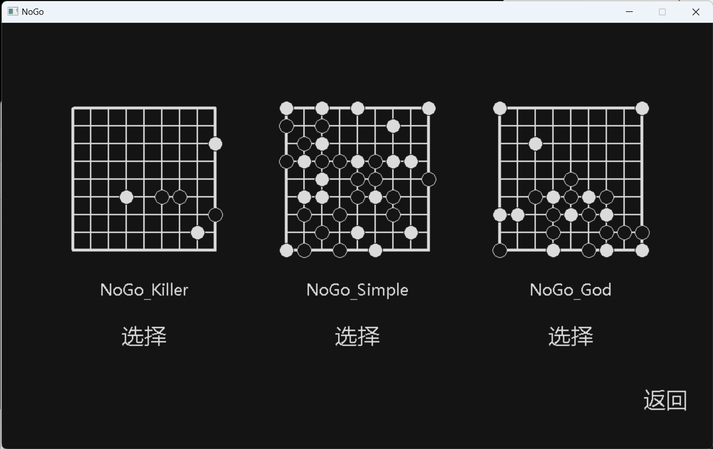

# NoGo Game

Welcome to the NoGo game repository! This project is a game implementation of NoGo, written in C and featuring a simple GUI created using [EasyX](https://easyx.cn/). NoGo is a two-player strategic board game, and you can find more information about the game itself [here](https://www.botzone.org.cn/game/NoGo). This tiny project was developed during my freshman year when I was a beginner in programming.

## Features

### 1. Simple GUI with EasyX

The game comes with a user-friendly graphical user interface (GUI) built using EasyX. EasyX is a graphics library for C/C++ that simplifies the process of creating graphical applications.

### 2. Powerful AI System

The AI system in this game is backed by a combination of minimax algorithm and Monte Carlo Tree Search (MCTS). This makes for a challenging opponent, providing an engaging experience for players.

### 3. Save and Load System

No need to worry about losing your progress! The game features a save and load system, allowing you to save your game state and resume it later.

## Installation

**Note: This code only is for Windows system.**

To run the NoGo game on your machine, follow these steps:

1. Clone the repository to your machine:
2. Compile the source code using your preferred C compiler, ensuring that you have EasyX properly installed.
3. Run the compiled executable to start playing the game.

## Snapshots

*Caption: A snapshot of the NoGo game board in action.*

*Caption: Another view showcasing the game's graphical user interface.*
